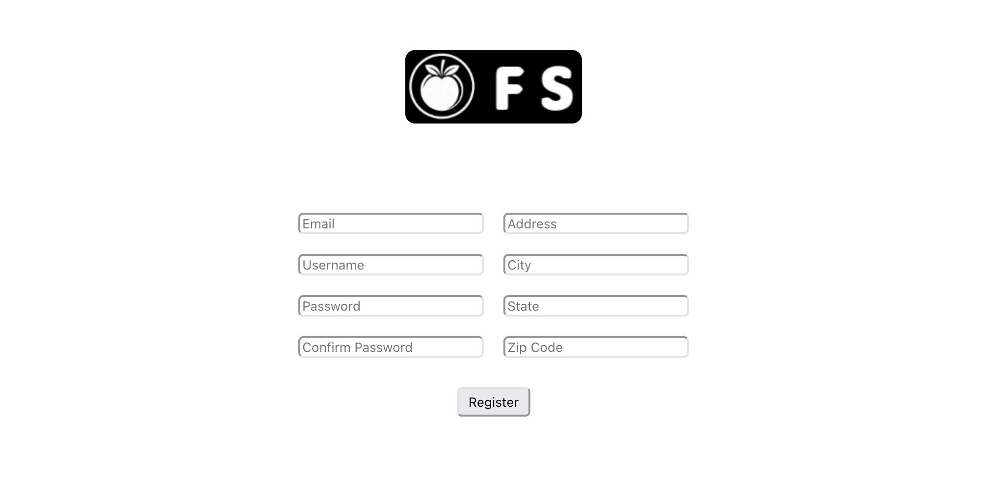
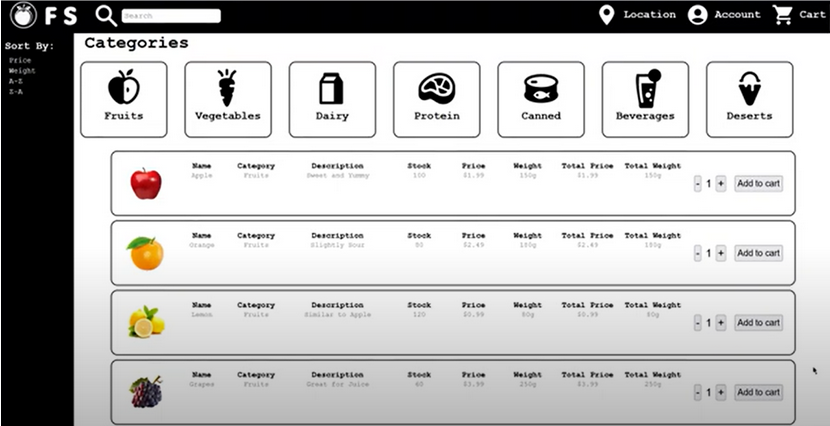
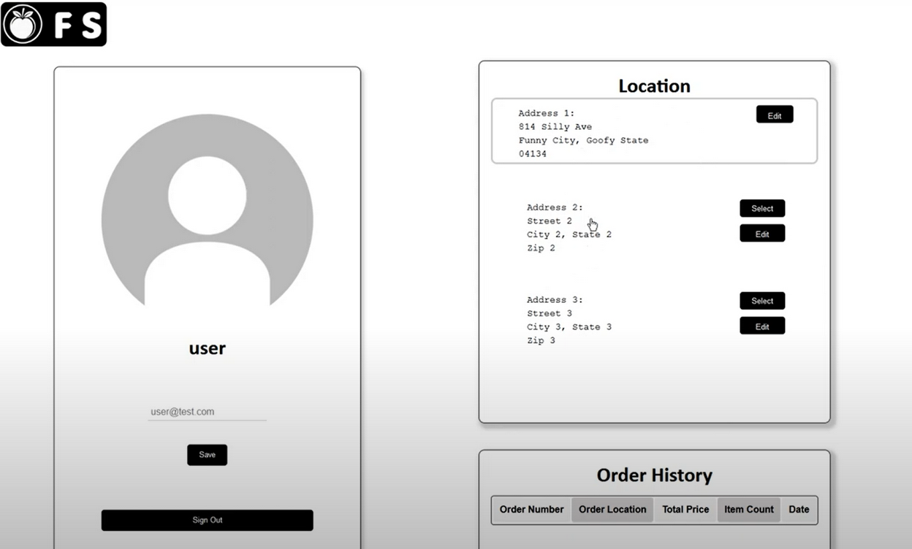
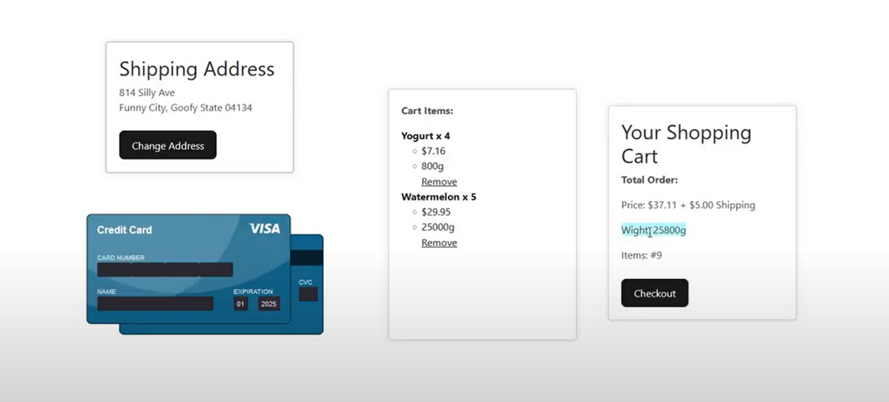
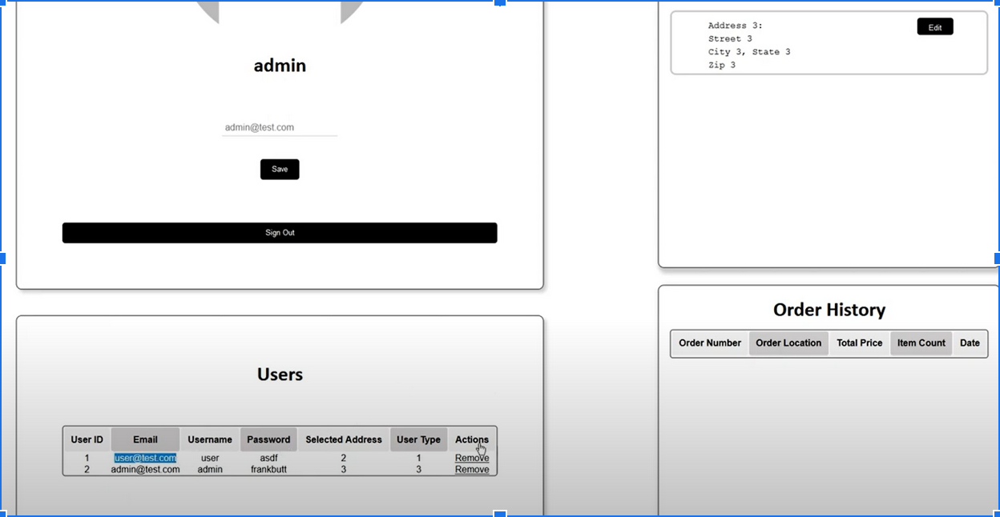
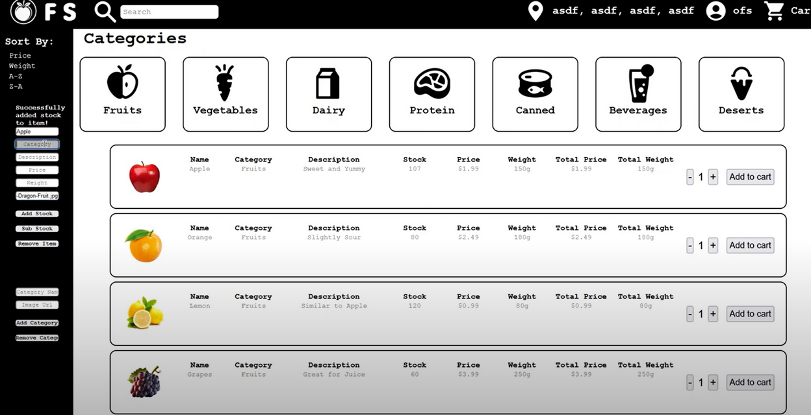

# Study Sync

## Table of contents

1. Install and Setup Guide

## Install and Setup Guide:

If you have any issues setting up the project contact: jeremy.greatorex@sjsu.edu

### Requirements:

Install Node.js LTS

Install Git
(to try pulling from our repo if the zipped file does not run)

Install MySql
(i needed to add mysql to path
to do this navigate to mysql bin directory
probably at C:\Program Files\MySQL Server 8.0\bin
once you find it copy this path should look something like such above
hit windows
type env
click edit the system environment variables
click Enviroment Variables
in bottom half in system variables find variable path
click that
edit
new
past in the path)

(remember the password you give mysql we will remove later it for the sake of development)

### Pre-Setup:

Make folder for project

Open terminal

Navigate to folder

run: git init

run: git remote add origin git@github.com:venajeremy/StudySync

run: git pull origin main (if this doesn't work try running git branch main and then try again)

### MySQL-Set-Up:

Open VSCode (this is what we used, any terminal is fine)

Open the folder you created

Double check you see client and server folders (as well as aditional txt files)

Open two integrated terminals

Navigate one to server folders

Navigate the other to vite-project folder within the client folder (these will run the backend node.js and frontend react development server respectively)

Go to terminal in server directory

run: mysql -u root -p

Enter the password you gave it earlier

Should be within the mysql server

run: SET PASSWORD FOR root@localhost='';         (this removes the password on the mysql database, there is an .env file that the node.js server uses to authenticate. You can instead set the MYSQL_USER and MYSQL_PASSWORD in this .env file located at /WebProject/server/.env to authenticate into your mysql database with an actual username and password)

In VSCode in the server folder find schema.sql   (contains all the commands to generate our database, tables, and inventory)

Copy everything inside

Click back into mysql terminal

Paste everything w/ right click (should do multiple commands at once to create database and table)

Make sure to press enter to run last command

run: show databaes;

Make sure there is the studysync database

run: use studysync;

run: show tables;

Should respond with the following tables:

With at least the users table

run: select * from users;

Make sure it returns the default users

run: exit

### Node.js-Set-Up:

Get in server directory

run: npm run dev       (this starts backend node.js server)

Allow any permissions

#### NOTE: In this tutorial we are going to be using our webpage via the react development server (the one we run from /WebProject/client/vite-project). Though we can "compile" the react and run the webserver soley from the node.js backend server.  THIS IS NOT MANDITORY TO SEE FUNCTIONALITY OF SITE: To do this in the /WebProject/client/vite-project run: npm run build.  This will generate a new dist folder located WebProject/client/vite-project/dist.  To run the webpage in development drag this dist folder into WebProject/server.  Additionally you will have to copy in all images.  To do this copy all images from the client/vite-project/src/assets folder into the new assets folder within the dist folder now in /WebProject/server.  Now to access the webpage (after starting node.js backend) in the browser url use localhost:8080 port of the backend rather than the localhost:5173 port of the react development server

### Vite&React-Set-Up:

Click onto vite-project (within client folder) terminal

run: npm install        (npm should install all dependencies in the package.json file located /WebProject/client/vite-project/package.json)
(if anything goes wrong its probably going to be this)

Wait

run: npm run dev

Should start frontend development server

Copy the local url (http://localhost:5173) & slap it into your browser

If all works well the webpage should be successfully up and running. if any errors occur please send me a screenshot the error (if any) in the browser development console, a screenshot of the react development server terminal, and a screenshot of the node.js backend server terminal.  This will greatly help me identify what went wrong!

## Main Topic Header

#### More info. 

> [!NOTE]
>  Some note. 

### Once you have created an account, you get a login button that prompts you to the login page.
### The premade account credentials for accessing the website is as shown below:

| Username | Password| 
| ------- | ------- |
| user | asdf |

## Main Page 

#### The webpage will be broken down into a couple sections. On the very top, there is the navigation bar, which houses our search bar, location, account, and cart. Right below is where our category section is located. Here, the customers can find all the categories they would need in order to proceed with their purchases. The location of the category is decided as it is an easy navigation for users of all ages.  Fruits, Vegetables, Dairy, Protein, Canned, Beverage, and Deserts are the main categories, and once the user clicks on their desired category, they will find all the products listed right below it, which takes the center bit of our web page design. As shown in the attached screenshot down below, all the products are listed vertically, while their information is listed horizontally. This yields an easy to visualize result, and people would not spend too much time navigating, which increases the productivity of individuals. We understand, from a user's perspective, that no one wants to spend a long time navigating through a grocery website, which is why we have implemented all the descriptions on the main page, instead of having them open up another page just to have something added to their carts. This is the same with all the other categories. One major function that we have is that we have a “sort” function which allows the user to sort their products based on weight, price, and order of the alphabet. 

## Account Page

#### If you were to click on the account icon, the system would take the user to a separate account page which shows the user’s name, location, and order history, which is shown in the picture below. The addresses could also be edited and changed, and the changed address would be shown on the main page as well. These are all saved in the database. 

## Cart

#### As we go through the process of food ordering, one could adjust the quantity of the products they want to purchase in the mainpage before adding to cart, and they could also do multiple “add to cart”, which would serve the same purpose. Once the user is done with their shopping, they would need to click the cart button to take them to the cart page, which is where they will find three sections of their information all listed on the same page, without having to scroll up and down.

#### In the center of the page is where we can find the cart items. Here, there is an option to remove the times needed. If the card information is invalid, the user would not be able to proceed with the orders. The weight is also going to be counted as a factor of the delivery pricing, as once reached 20 pounds, there will be a surplus in the shipping cost of 5 dollars. 

> [!NOTE]
> If you need to access your order history or any receipts, they will be in the account page under 'Order History'

## Admin Account 

### Admin accounts can be created by using a secret passcode in the account registration page. When typed in “frankbutt” as the password, an admin account is automatically generated. The main page of the admin account would look exactly the same as it would on an user webpage, but when clicked in the account, the admin would have full access to all the users that are registered and their order history. User type is also shown as 1 being the regular user, 2 being a storefront employee, and 3 being admin. The option to remove the user is also there too. 

### The premade account credentials for admin access is:
| Username | Password |
| ------------- | ------------- |
| admin | frankbutt | 

## Employee Account

### An employee account follows the same concept, only this time, the secret password is going to be “ofslover”, and this would allow the system to generate an employee account. As shown in the picture below, the employee account has an added functionality which is shown in the very left column. This functionality allows the employee to add, delete, increase, decrease and change the weight of any products. This again is very straightforward to produce. The employee could also add a category to the list, in case the store increase their scope of services. 

### The premade account credentials for employee access is:
| Username | Password |
| ------------- | ------------- |
| employee | ofslover | 

